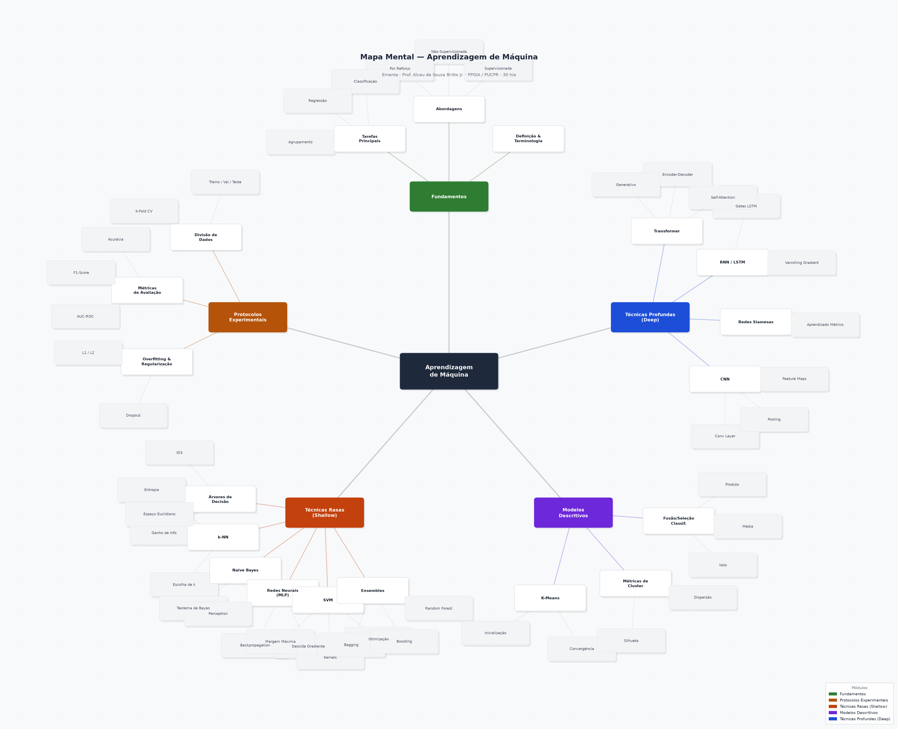

# Machine Learning — Research Fundamentals Study Plan

> PPGIA / PUC-PR · MSc 2026 · Aprendizagem de Máquina  
> Fernando Dantas · [fsd-dantas.github.io/machine-learning-fundamentals](https://fsd-dantas.github.io/machine-learning-fundamentals)

---

<p align="center">
  <picture class="github-mode-only">
    <source media="(prefers-color-scheme: dark)" srcset="assets/img/mindmap.png">
    
  </picture>
  
  
</p>

---

## Concept & Framing

This repository is **not a class syllabus mirror**. It is a **personal research roadmap** for the foundational concepts of Machine Learning, built around the structure of the discipline as taught by Prof. Alceu de Souza Britto Jr. at PPGIA/PUC-PR, but reframed as a self-directed learning and research reference.

The guiding philosophy borrows from dependency-graph learning resources (e.g., [Metacademy](https://metacademy.org), [roadmap.sh/machine-learning](https://roadmap.sh/machine-learning)) and knowledge-atlas projects (e.g., [mrdbourke/machine-learning-roadmap](https://github.com/mrdbourke/machine-learning-roadmap)): **every concept has prerequisites, and every activity connects back to a cluster of foundational ideas**.

This site exists to:

1. Map the ML concept space as a navigable knowledge graph — mirroring the mind map above
2. Provide curated references per concept cluster — professor-assigned and beyond
3. Document hands-on experimental work (Atividade 1 and future activities)
4. Serve as a public-facing academic portfolio page for the MSc journey

**Language:** English throughout, to reach broader audiences and align with international research norms. Original Portuguese course materials are credited faithfully.

---

## Repository Structure

The repository is fully Markdown-based. GitHub renders it natively; Obsidian can mirror it as a local vault. No build toolchain required.

```
/
├── README.md                        # This file — landing page and specification
├── modules/
│   ├── 01-foundations.md            # Fundamentos (math, geometry, probability)
│   ├── 02-protocols.md              # Experimental Protocols (CV, metrics, design)
│   ├── 03-shallow.md                # Shallow Techniques (classifiers & regressors)
│   ├── 04-descriptive.md            # Descriptive Models (clustering, dim-reduction)
│   └── 05-deep.md                   # Deep Techniques (MLP, CNN, RNN+)
├── activities/
│   └── atividade-1.md               # Activity 1 — Shallow models: classification & regression
├── assets/
│   └── img/
│       ├── mindmap.png              # Mind map — dark variant
│       └── mindmap-light.png        # Mind map — light variant
└── references.md                    # Full ABNT bibliography (professor's + extended)
```

> **Rendering targets:** GitHub (primary) and Obsidian (secondary). The `<picture>` pattern used for images supports `prefers-color-scheme` on GitHub and Obsidian CSS snippet hooks (`obsidian-light-only` / `obsidian-dark-only`) for local preview.

---

## Module Map

Each module is a self-contained Markdown file that follows a consistent content schema (detailed below). They map directly to the five colour-coded clusters in the mind map.

| # | Module | Theme | File |
|---|--------|-------|------|
| 1 | **Foundations** | Mathematics, geometry, probability theory | [`modules/01-foundations.md`](modules/01-foundations.md) |
| 2 | **Experimental Protocols** | Cross-validation, evaluation metrics, experimental design | [`modules/02-protocols.md`](modules/02-protocols.md) |
| 3 | **Shallow Techniques** | Supervised classifiers and regressors | [`modules/03-shallow.md`](modules/03-shallow.md) |
| 4 | **Descriptive Models** | Unsupervised learning, clustering, dimensionality reduction | [`modules/04-descriptive.md`](modules/04-descriptive.md) |
| 5 | **Deep Techniques** | MLP, CNN, RNN, modern architectures | [`modules/05-deep.md`](modules/05-deep.md) |

---

## Content Schema (per module file)

Every module file follows this structure, in order:

### 1. Concept Overview
A concise paragraph establishing what the module covers and how it connects to the broader ML landscape. Written at MSc level — assumes mathematical literacy.

### 2. Prerequisites
A short dependency list: concepts the reader should be comfortable with before entering this module. Links to the relevant preceding module file or external references.

### 3. Key Concepts & Techniques
A structured breakdown of the main ideas — presented as a scannable reference, not lecture notes. Each entry includes:
- Core definition (1–2 sentences)
- Formal notation where applicable (LaTeX inline or block)
- Key hyperparameters / design decisions
- Common pitfalls

### 4. Professor's References
Exact bibliographic entries from Prof. Alceu de Souza Britto Jr.'s syllabus, formatted in ABNT. Preserved verbatim as the authoritative reading list for this course. Linked to `references.md` for the full list.

### 5. Extended Reading
Curated external references beyond the syllabus — landmark papers, textbook chapters, open-access resources — selected for research-grade depth.

### 6. Connected Activities
Links to hands-on work in `/activities/` that exercise concepts from this module.

---

## Index Page (this README)

`README.md` serves as the **concept graph entry point**. Beyond the mind map and module table above, it includes:

- **Mission statement** — why this study plan exists (above)
- **Research context** — how ML connects to the author's SDN/Smart Grid/VNF thesis work (below)
- **Activities index** — compact list of submitted work linking to `/activities/`
- **References** — link to the full `references.md`

---

## Research Context

Fernando Dantas's MSc research at PPGIA/PUC-PR focuses on **Software-Defined Networking (SDN)**, **Smart Grid** orchestration, and **Virtual Network Functions (VNF)** management — primarily on the [ONOS](https://opennetworking.org/onos/) platform. Machine Learning is studied here as a foundational tool for intelligent network management. Concrete application areas:

| ML Technique | Research Application |
|---|---|
| Supervised classification | Anomaly detection in SDN traffic flows |
| Regression | Power-load forecasting in Smart Grid scenarios |
| Clustering | Network slice segmentation and topology grouping |
| RNN / LSTM | Time-series prediction for VNF auto-scaling decisions |

This framing is intentional: every technique studied in this course is evaluated not only on the benchmark datasets assigned in class, but also against its potential utility in the SDN/Smart Grid domain.

---

## Activities

### Atividade 1 — Shallow Models: Classification & Regression

Full write-up: [`activities/atividade-1.md`](activities/atividade-1.md)

**Part A — Classification (Breast Cancer Wisconsin)**
- 569 instances · 30 continuous attributes · Binary target (0 = malignant, 1 = benign)
- Classifiers: Decision Tree, k-NN, Naive Bayes, SVM, MLP, Random Forest, Bagging, AdaBoost, XGBoost
- Protocol: 5-fold cross-validation · Metrics: Accuracy, F1, Precision, Recall

**Part B — Regression (Diabetes dataset)**
- 442 instances · 10 numeric attributes · Continuous target (range 25–346)
- Regressors: Decision Tree, k-NN, SVR, MLP, Random Forest, Bagging, XGBoost
- Protocol: 5-fold cross-validation · Metrics: R², MAE

---

## Image Pattern Reference

All adaptive images in this repository use the following pattern, supporting both GitHub's native `prefers-color-scheme` and Obsidian CSS snippet hooks:

```html
<p align="center">
  <picture class="github-mode-only">
    <source media="(prefers-color-scheme: dark)" srcset="assets/img/example-dark.png">
    
  </picture>
  
  
</p>
```

- `class="github-mode-only"` — rendered by GitHub, hidden in Obsidian via CSS snippet
- `obsidian-light-only` / `obsidian-dark-only` — rendered by Obsidian snippet, hidden on GitHub
- The `width="0" height="0"` trick makes the fallback images invisible on GitHub while remaining accessible to Obsidian's renderer

---

## Rendering & Tooling

| Context | How it renders |
|---|---|
| **GitHub** (primary) | Native Markdown + HTML subset; `<picture>` adaptive images; LaTeX via MathJax (enabled in repo settings) |
| **Obsidian** (secondary) | Local vault mirror; CSS snippet required for `obsidian-light-only` / `obsidian-dark-only` class hooks |
| **VS Code** | Markdown Preview with standard GFM rendering |

> **LaTeX in GitHub Markdown:** GitHub renders LaTeX math when delimited with `$...$` (inline) or `$$...$$` (block) in `.md` files, provided the repository has math rendering enabled. This repository uses that syntax for all formal notation.

---

## Roadmap

- [ ] Convert mind map from static PNG to interactive SVG (theme-adaptive, single file)
- [ ] Open a dedicated SDN/Smart Grid research repo and link from the Research Context section
- [ ] Add future activity write-ups to `/activities/` as the course progresses

---

## Reference Sites & Inspirations

| Resource | Design principle borrowed |
|---|---|
| [roadmap.sh/machine-learning](https://roadmap.sh/machine-learning) | Step-by-step concept ordering; community-curated dependency structure |
| [Metacademy](https://metacademy.org) | Prerequisites-first navigation; "learn X to understand Y" framing |
| [learney.me](https://app.learney.me/) | Skill-tree visual layout; concept clustering |
| [mrdbourke/machine-learning-roadmap](https://github.com/mrdbourke/machine-learning-roadmap) | Connecting concepts ↔ tools ↔ math ↔ resources in one view |
| [bishwaghimire/ai-learning-roadmaps](https://github.com/bishwaghimire/ai-learning-roadmaps) | Modular research-grade progression: foundations → specialisation → research |
| [prathyvsh/knowledge-atlases](https://github.com/prathyvsh/knowledge-atlases) | Catalogue framing; knowledge maps as navigable atlases |
| [imteekay/machine-learning-research](https://github.com/imteekay/machine-learning-research) | Research-oriented README structure; annotated reading lists |

---

*Last updated: June 2026.*  
*Course: Aprendizagem de Máquina · PPGIA/PUC-PR · MSc 2026*  
*Instructor: Prof. Alceu de Souza Britto Jr. (alceu@ppgia.pucpr.br)*
