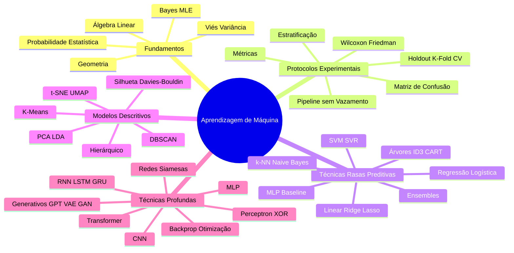
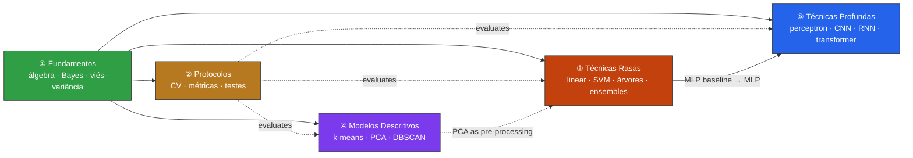

# Mind Map (Markdown-native)

> The interactive version lives at [`pages/mapa-mental.html`](pages/mapa-mental.html) (JavaScript + SVG). This file is the **Markdown source of truth** for the same structure — it renders natively on GitHub and in Obsidian via [Mermaid](https://mermaid.js.org/), with no build step and no JavaScript.
>
> Two views: a **hierarchical mind map** (the taxonomy) and a **dependency graph** (adds the "what-you-need-first" prerequisite links).

---

## View 1 — Hierarchical mind map

A clean tree of the five modules and their concepts. Mirrors the interactive map's taxonomy.

<!-- BEGIN GENERATED: mindmap — source of truth is mind-map.json; run scripts/build_mindmap.py to regenerate. DO NOT EDIT BY HAND. -->

<!-- END GENERATED: mindmap -->

---

## View 2 — Dependency graph (prerequisites)

The same modules, but the arrows now encode **what you should understand first** — realising the "every concept has prerequisites" philosophy that a pure tree cannot show. Foundations feeds everything; Protocols is used to evaluate every predictive method; the shallow MLP is the bridge into Deep. Node labels are clickable in Obsidian and Mermaid Live (GitHub renders the graph but ignores the links).

<!-- BEGIN GENERATED: flowchart — source of truth is mind-map.json; run scripts/build_mindmap.py to regenerate. DO NOT EDIT BY HAND. -->

<!-- END GENERATED: flowchart -->

> Tooltips above are the Portuguese module labels; the links open the module files.

---

## Why Mermaid (and where each view renders)

| Target | `mindmap` | `flowchart` | Clickable links |
|---|---|---|---|
| **GitHub** (`.md` preview) | ✅ renders | ✅ renders | ❌ ignored (security) |
| **Obsidian** | ✅ renders | ✅ renders | ✅ works |
| **VS Code** (Markdown Preview Mermaid ext.) | ✅ | ✅ | ✅ |
| **Mermaid Live Editor** | ✅ | ✅ | ✅ |

## ⚠️ How to edit (single source of truth)

The two diagrams above and the data behind the interactive [`pages/mapa-mental.html`](pages/mapa-mental.html) are **all generated from one file: [`mind-map.json`](mind-map.json)**. Never edit the `GENERATED` regions by hand.

```bash
# 1. edit the graph
$EDITOR mind-map.json          # modules, nodes (with x/y for the SVG), edges, prerequisites

# 2. regenerate every view
python scripts/build_mindmap.py

# 3. (CI does this) verify nothing drifted
python scripts/build_mindmap.py --check
```

`mind-map.json` fields: `modules` (label, color, order, blurb) · `nodes` (id, label, x, y, type, module, link, desc) · `edges` (root→module→concept tree, used by the mindmap + SVG) · `prerequisites` (module→module dependency links, used by the flowchart). CI (`.github/workflows/validate.yml`) fails if the generated views are out of date.

**Editing notes:**
- Mermaid `mindmap` treats `()`, `[]`, `{}` as *shape* syntax; the generator strips them from concept labels automatically (and turns `\n` into spaces).
- Extend the **`prerequisites`** list to grow the dependency graph without touching the taxonomy.
- The `x`/`y` coordinates in each node position it in the interactive SVG only; the Mermaid views auto-layout and ignore them.

---

*[← README](README.md) · [Study Guide](study-guide.md) · [Interactive map](pages/mapa-mental.html)*
